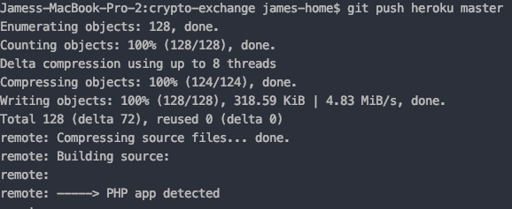

# Crypto Exchange
A mock crypto-currency exchange application written in vanilla PHP.

## Getting Started
 
### Database
The current configuration uses environment variables to load database configuration.
If the environment variables need to be changed for development purposes, please refer to
this [article](https://scotch.io/tutorials/how-to-use-environment-variables) on how to change
your environment variables based on your operating system.
 
To create the database from the first time, uncomment from **index.php** load the page. 
```
/*
use CryptoDB;
$db = new CryptoDB();
$db->createTables();
*/
```
**IMPORTANT:** Only load the page once and immediately comment after table creation.
Failure to do so can create errors in the DB. This may also not be necessary if one configures the 
database with a separate client such as _phpMyAdmin_.

### Deploying to Heroku

Deploying this app to Heroku requires **Git BASH** and **Heroku CLI**. Please install the following applications
if they are not already on your system.

First, clone this repository to your local directory.
```
git clone https://github.com/jpham93/crypto-exchange.git
```

Once you have a local copy, log onto Heroku with the CLI.
```
heroku login
```


And the browser login page will launch. Log in with your Heroku credentials.


Once Successfully logged in, create the app on Heroku.

```
heroku create
```


Go into your Heroku dashboard, select the newly created application,
and go to **Settings**. Add the following config variables and change
the values to reflect your database credentials.


When ready, deploy your application with the following command:
```
git push heroku master
```



And there you have it! Your application should be successfully 
deployed in the cloud!

### OPTIONAL:
Heroku will automatically create an named application for you which
you can manage on your heroku dashboard. If you would like to rename
the application, change the name under the "Settings" tab in the 
application dashboard.


**IMPORTANT:** You also need to change git's remote connection,
otherwise you may not be able to upload changes to the application.
```
git remote set-url heroku [Heroku Git URL]  
``` 


